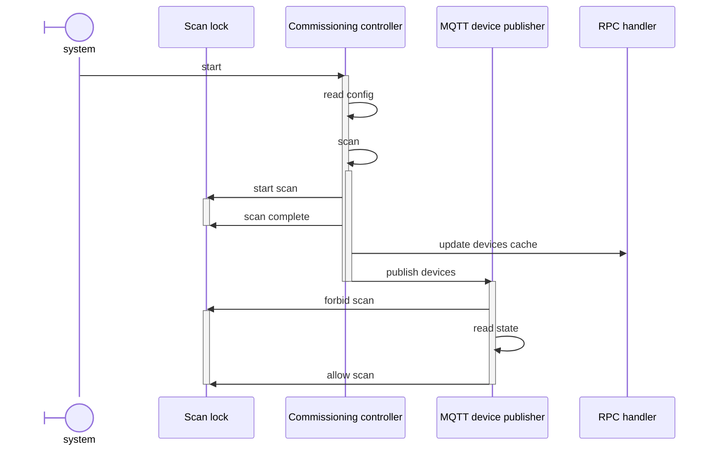
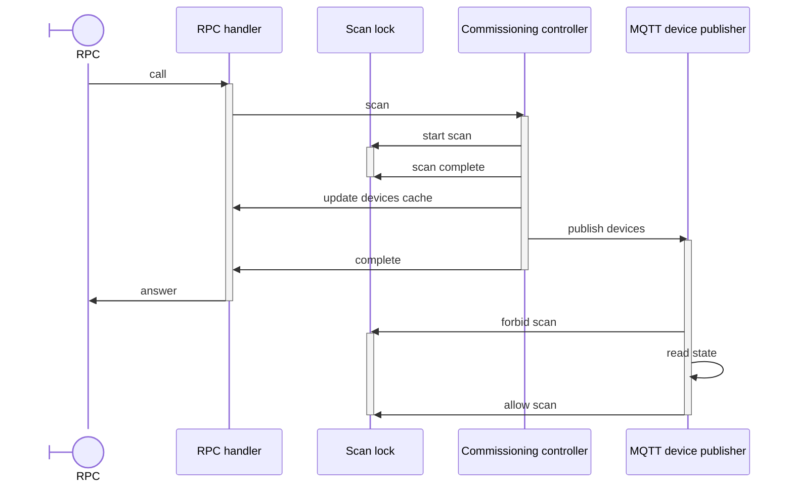
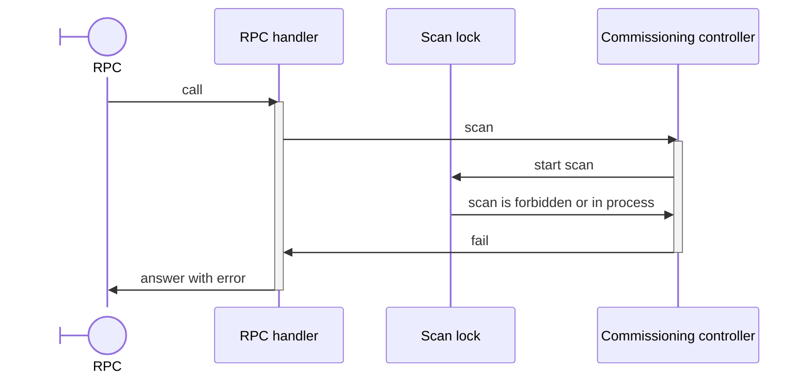
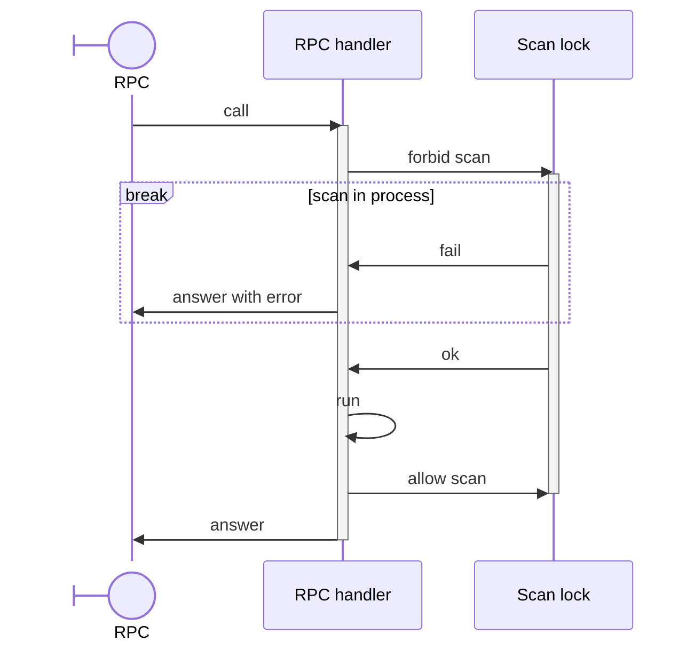
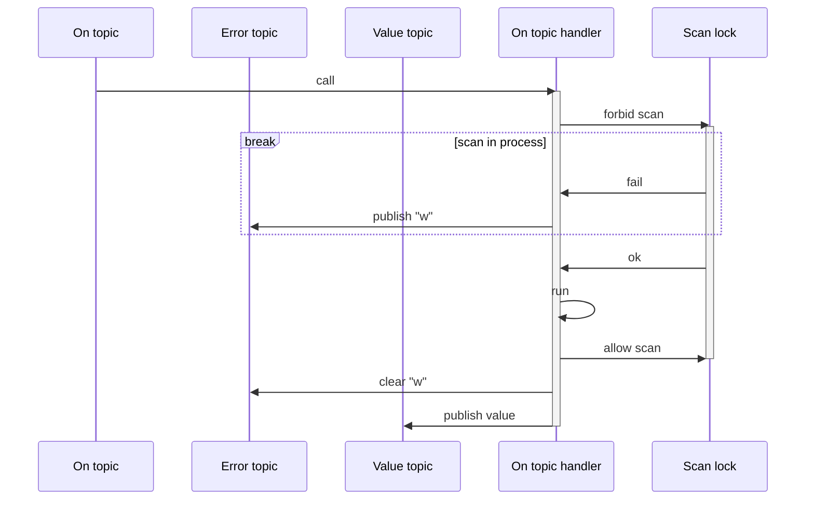
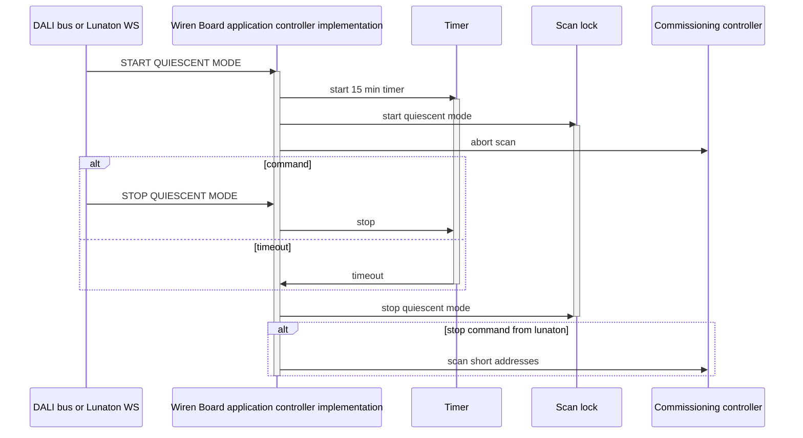

Первый запуск

```mermaid
sequenceDiagram
    participant system@{ "type" : "boundary" }
    participant Lock as Scan lock
    participant C as Commissioning controller
    participant Publisher as MQTT device publisher
    system->>C: start
    activate C
    C->>C: read config
    C->>C: scan
    activate C
    C->>Lock: start scan
    activate Lock
    C->>Lock: scan complete
    deactivate Lock
    C->>RPC handler: update devices cache
    C->>Publisher: publish devices
    deactivate C
    deactivate C
    activate Publisher
    Publisher->>Lock: forbid scan
    activate Lock
    Publisher->>Publisher: read state
    Publisher->>Lock: allow scan
    deactivate Publisher
    deactivate Lock
```

RPC пересканирования

```mermaid
sequenceDiagram
    participant RPC@{ "type" : "boundary" }
    participant Handler as RPC handler
    participant Lock as Scan lock
    participant C as Commissioning controller
    participant Publisher as MQTT device publisher
    RPC->>Handler: call
    activate Handler
    Handler->>C: scan
    activate C
    C->>Lock: start scan
    activate Lock
    C->>Lock: scan complete
    deactivate Lock
    C->>Handler: update devices cache
    C->>Publisher: publish devices
    activate Publisher
    C->>Handler: complete
    deactivate C
    Handler->>RPC: answer
    deactivate Handler
    Publisher->>Lock: forbid scan
    activate Lock
    Publisher->>Publisher: read state
    Publisher->>Lock: allow scan
    deactivate Publisher
    deactivate Lock
```

RPC пересканирования с ошибкой

```mermaid
sequenceDiagram
    participant RPC@{ "type" : "boundary" }
    participant Handler as RPC handler
    participant Lock as Scan lock
    participant C as Commissioning controller
    RPC->>Handler: call
    activate Handler
    Handler->>C: scan
    activate C
    C->>Lock: start scan
    Lock->>C: scan is forbidden or in process
    C->>Handler: fail
    deactivate C
    Handler->>RPC: answer with error
    deactivate Handler
```

RPC настройки

```mermaid
sequenceDiagram
    participant RPC@{ "type" : "boundary" }
    RPC->>RPC handler: call
    activate RPC handler
    RPC handler->>Scan lock: forbid scan
    activate Scan lock
    break scan in process
        Scan lock->>RPC handler: fail
        RPC handler->>RPC: answer with error
    end
    Scan lock->>RPC handler: ok
    RPC handler->>RPC handler: run
    RPC handler->>Scan lock: allow scan
    deactivate Scan lock
    RPC handler->>RPC: answer
    deactivate RPC handler
```

Обработка On топика

```mermaid
sequenceDiagram
    participant O@{ "type" : "boundary" }
    participant O as On topic
    participant E as Error topic
    participant V as Value topic
    participant H as On topic handler
    participant L as Scan lock
    O->>H: call
    activate H
    H->>L: forbid scan
    activate L
    break scan in process
        L->>H: fail
        H->>E: publish "w"
    end
    L->>H: ok
    H->>H: run
    H->>L: allow scan
    deactivate L
    H->>E: clear "w"
    H->>V: publish value
    deactivate H
```

Multi-master quiescent mode

```mermaid
sequenceDiagram
    participant B as DALI bus or Lunaton WS
    participant AC as Wiren Board application controller implementation
    participant Timer
    participant Lock as Scan lock
    participant C as Commissioning controller
    B->>AC: START QUIESCENT MODE
    activate AC
    AC->>Timer: start 15 min timer
    activate Timer
    AC->>Lock: start quiescent mode
    activate Lock
    AC->>C: abort scan
    alt command
        B->>AC: STOP QUIESCENT MODE
        AC->>Timer: stop
    else timeout
        Timer->>AC: timeout
        deactivate Timer
    end
    AC->>Lock: stop quiescent mode
    deactivate Lock
    alt stop command from lunaton
        AC->>C: scan short addresses
    end
    deactivate AC
```
