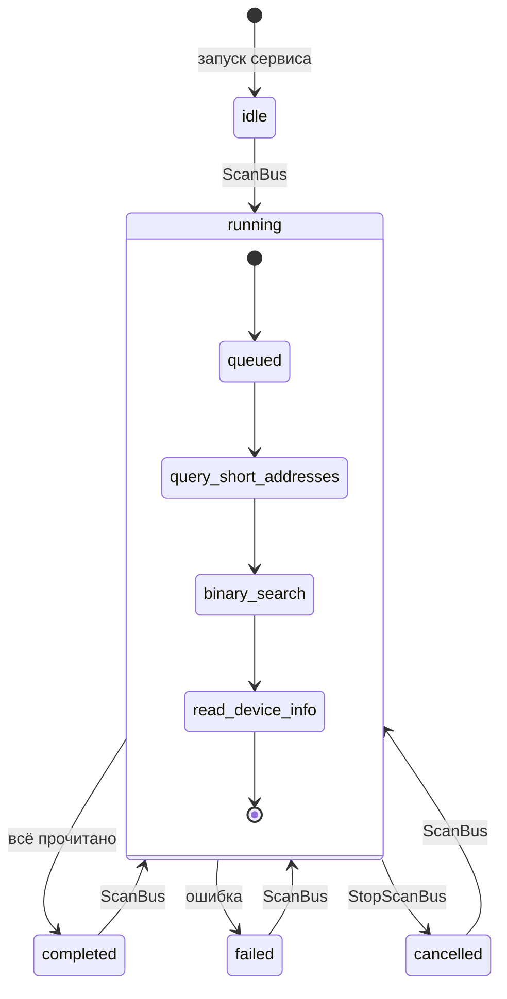
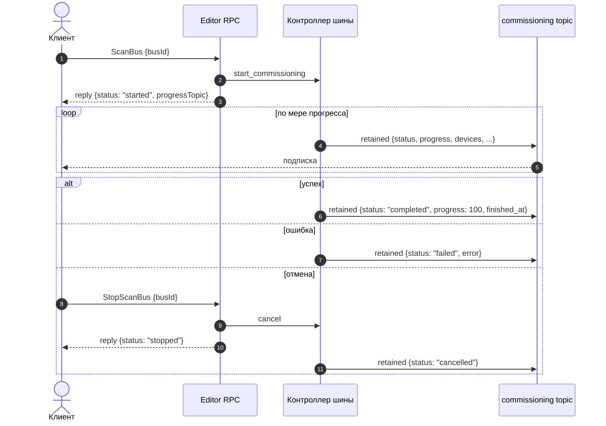

# Служебный MQTT-RPC API

> **Внимание:** Эти методы — служебные. Их использует веб-редактор конфигурации `wb-mqtt-dali`, и они **могут меняться без сохранения обратной совместимости**. Для интеграций используйте публичные методы, описанные в [README](../README.md#mqtt-rpc-api).

Формат топиков и общей структуры запроса/ответа — единый для всех методов RPC, см. [README / MQTT-RPC API](../README.md#mqtt-rpc-api). 

## Editor/GetList

Топик `/rpc/v1/wb-mqtt-dali/Editor/GetList/<clientId>`

Вернуть всё дерево активной конфигурации: шлюзы → шины → устройства, плюс текущее состояние поиска устройств (commissioning) по каждой шине.

### Параметры

Метод не принимает параметров.

### Ответ

```jsonc
[
  {
    // UID шлюза (device_id из конфига)
    "id": "wb-mdali_1",

    // Имя для отображения
    "name": "wb-mdali_1",

    // Шины этого шлюза
    "buses": [
      {
        // UID шины (<mqtt_id>)
        "id": "wb-mdali_1_bus_1",

        // Имя для отображения
        "name": "Bus 1",

        // Известные устройства на шине
        "devices": [
          {
            // UID устройства
            "id": "wb-mdali_1_bus_1_0",

            // Имя для отображения
            "name": "Kitchen LED",

            // Номера DALI-групп, в которые входит устройство
            "groups": [0, 3]
          }
        ],

        // Текущее состояние поиска устройств (commissioning) на шине. Та же структура, что и у
        // топика /wb-dali/<busUid>/commissioning (раздел «Commissioning»).
        "commissioning": {
          "status": "idle",
          "progress": 0,
          "error": null,
          "devices": [],
          "device_count": 0,
          "finished_at": null
        }
      },
      ...
    ]
  },
  ...
]
```

## Editor/GetGateway

Топик `/rpc/v1/wb-mqtt-dali/Editor/GetGateway/<clientId>`

Прочитать настройки одного шлюза.

### Параметры

```jsonc
{
  // UID шлюза. Обязательный.
  "gatewayId": "wb-mdali_1"
}
```

### Ответ

```jsonc
{
  // Текущие настройки шлюза
  "config": {
    "websocket_enabled": true,
    "websocket_port": 8080,
    ...
  },
}
```

## Editor/SetGateway

Топик `/rpc/v1/wb-mqtt-dali/Editor/SetGateway/<clientId>`

Поменять настройки шлюза.

### Параметры

```jsonc
{
  // UID шлюза. Обязательный.
  "gatewayId": "wb-mdali_1",

  // Новые значения настроек шлюза. Обязательный.
  "config": {
    "websocket_enabled": true,
    "websocket_port": 8080,
    ...
  }
}
```

### Ответ

Применённые настройки

```jsonc
{
  "websocket_enabled": true,
  "websocket_port": 8080
}
```

## Editor/GetBus

Топик `/rpc/v1/wb-mqtt-dali/Editor/GetBus/<clientId>`

Прочитать настройки одной DALI-шины.

### Параметры

```jsonc
{
  // UID шины. Обязательный.
  "busId": "wb-mdali_1_bus_1"
}
```

### Ответ

```jsonc
{
  // Текущие настройки шины
  "config": {
    "polling_interval": 5,        // период опроса, секунды
    "bus_monitor_enabled": false,
    ...
  },

  // JSON Schema редактируемых полей шины (с учётом метаинформации от модуля)
  "schema": { ... }
}
```

## Editor/SetBus

Топик `/rpc/v1/wb-mqtt-dali/Editor/SetBus/<clientId>`

Поменять настройки DALI-шины.

### Параметры

```jsonc
{
  // UID шины. Обязательный.
  "busId": "wb-mdali_1_bus_1",

  // Новые значения настроек шины. Обязательный.
  "config": {
    "polling_interval": 5,
    "bus_monitor_enabled": false,
    ...
  }
}
```

### Ответ

Применённые настройки

```jsonc
{
  "polling_interval": 5,
  "bus_monitor_enabled": false
}
```

## Editor/GetDevice

Топик `/rpc/v1/wb-mqtt-dali/Editor/GetDevice/<clientId>`

Прочитать настройки одного DALI-устройства (имя, DT-параметры).

### Параметры

```jsonc
{
  // UID устройства. Обязательный.
  "deviceId": "wb-mdali_1_bus_1_0",

  // Перечитать DT-параметры с шины перед ответом, даже если кэш уже есть. Необязательный, по умолчанию false.
  "forceReload": false
}
```

### Ответ

```jsonc
{
  // Текущие параметры устройства (имя, группы, DT-специфичные настройки)
  "config": { ... },

  // JSON Schema конфигурации, актуальная для DT этого устройства
  "schema": { ... }
}
```

## Editor/SetDevice

Топик `/rpc/v1/wb-mqtt-dali/Editor/SetDevice/<clientId>`

Заменить конфигурацию устройства целиком переданным `config`.

### Параметры

```jsonc
{
  // UID устройства. Обязательный.
  "deviceId": "wb-mdali_1_bus_1_0",

  // Новая конфигурация устройства целиком. Обязательный.
  "config": { ... }
}
```

### Ответ

Применённые параметры устройства — тот же объект, что приходит в `config` у `Editor/GetDevice`.

## Editor/GetGroup

Топик `/rpc/v1/wb-mqtt-dali/Editor/GetGroup/<clientId>`

Прочитать конфигурацию одной DALI-группы (имя, состав).

### Параметры

```jsonc
{
  // UID группы. Обязательный.
  "groupId": "wb-mdali_1_bus_1_group_00"
}
```

### Ответ

Объект с текущими параметрами группы (имя, состав).

## Editor/SetGroup

Топик `/rpc/v1/wb-mqtt-dali/Editor/SetGroup/<clientId>`

Изменить конфигурацию DALI-группы (имя, состав).

### Параметры

```jsonc
{
  // UID группы. Обязательный.
  "groupId": "wb-mdali_1_bus_1_group_00",

  // Новая конфигурация группы. Обязательный.
  "config": { ... }
}
```

### Ответ

Пустой объект `{}`.

## Editor/IdentifyDevice

Топик `/rpc/v1/wb-mqtt-dali/Editor/IdentifyDevice/<clientId>`

Физически идентифицировать устройство: для DALI-2 — стандартная процедура `Identify`, для классического DALI — несколько коротких миганий через `DAPC`.

### Параметры

```jsonc
{
  // UID устройства. Обязательный.
  "deviceId": "wb-mdali_1_bus_1_0"
}
```

### Ответ

Пустой объект `{}`.

## Editor/ResetDevice

Топик `/rpc/v1/wb-mqtt-dali/Editor/ResetDevice/<clientId>`

Послать DALI-команду `Reset`, освободить короткий адрес и **удалить устройство из активной конфигурации шлюза**: MQTT-топики устройства снимаются, файл конфигурации перезаписывается.

### Параметры

```jsonc
{
  // UID устройства. Обязательный.
  "deviceId": "wb-mdali_1_bus_1_0"
}
```

### Ответ

Пустой объект `{}`.

## Editor/ResetDeviceSettings

Топик `/rpc/v1/wb-mqtt-dali/Editor/ResetDeviceSettings/<clientId>`

Сбросить DALI-переменные одного устройства к заводским значениям. **Короткий адрес и запись в конфиге шлюза сохраняются**; MQTT-контролы устройства повторно публикуются.

### Параметры

```jsonc
{
  // UID устройства. Обязательный.
  "deviceId": "wb-mdali_1_bus_1_0"
}
```

### Ответ

Пустой объект `{}`.

## Editor/ScanBus

Топик `/rpc/v1/wb-mqtt-dali/Editor/ScanBus/<clientId>`

Запустить commissioning (поиск устройств) на указанной шине. Сам ход поиска приходит не в `/reply`, а в отдельный retained-топик `/wb-dali/<busUid>/commissioning` — см. раздел [Commissioning](#commissioning-топик-прогресса).

### Параметры

```jsonc
{
  // UID шины. Обязательный.
  "busId": "wb-mdali_1_bus_1"
}
```

### Ответ

```jsonc
{
  // "started" — поиск запущен; 
  // "already_running" — на шине уже идёт commissioning, новый не стартует
  "status": "started",

  // Полный путь к топику с прогрессом, для удобства подписки
  "progressTopic": "/wb-dali/wb-mdali_1_bus_1/commissioning"
}
```

## Editor/StopScanBus

Топик `/rpc/v1/wb-mqtt-dali/Editor/StopScanBus/<clientId>`

Прервать commissioning на указанной шине.

### Параметры

```jsonc
{
  // UID шины. Обязательный.
  "busId": "wb-mdali_1_bus_1"
}
```

### Ответ

```jsonc
{
  // "stopped" — отмена принята; 
  // "not_running" — на шине не было активного поиска
  "status": "stopped"
}
```

## Commissioning: топик прогресса

Состояние commissioning публикуется как **retained**-сообщение в `/wb-dali/<busUid>/commissioning`. При старте сервиса в топик пишется начальное `idle`-сообщение, дальше — обновления по мере прогресса, и финальное сообщение с терминальным статусом (`completed` / `failed` / `cancelled`).

### Структура сообщения

```jsonc
{
  // Текущая стадия: 
  //   "idle" 
  //   "queued"
  //   "query_short_addresses"
  //   "binary_search"
  //   "dali2_query_short_addresses"
  //   "dali2_binary_search"
  //   "read_device_info"
  //   "completed"
  //   "failed"
  //   "cancelled"
  "status": "binary_search",

  // Совокупный прогресс 0..100
  "progress": 37,

  // Сообщение об ошибке при status == "failed", иначе null
  "error": null,

  // Список устройств, найденных к текущему моменту
  "devices": [
    { 
      "id": "wb-mdali_1_bus_1_0", 
      "name": "Kitchen LED", 
      "groups": [0, 3]
    },
    ...
  ],

  // Кол-во найденных устройств
  "device_count": 1,

  // UTC-таймштамп (ISO) перехода в терминальный статус; null пока поиск идёт или система в idle.
  "finished_at": null
}
```

Значения `status`:

| Значение                      | Что означает                                                                 |
| ----------------------------- | ---------------------------------------------------------------------------- |
| `idle`                        | Поиск не идёт                                                                 |
| `queued`                      | Запрос принят, поиск ещё не стартовал (например, ждёт окончания другого RPC)  |
| `query_short_addresses`       | Опрос уже занятых коротких адресов                                            |
| `binary_search`               | Бинарный поиск по случайным адресам (классический DALI)                       |
| `dali2_query_short_addresses` | То же при сканировании DALI-2 фазы (если шина — DALI-2)                       |
| `dali2_binary_search`         | Бинарный поиск DALI-2                                                         |
| `read_device_info`            | Считывание DT-параметров найденных устройств                                  |
| `completed`                   | Поиск успешно завершён, новая конфигурация сохранена                          |
| `failed`                      | Поиск прерван ошибкой, см. `error`                                            |
| `cancelled`                   | Поиск отменён вручную (`StopScanBus`)                                         |

### Жизненный цикл



### Поток вызовов


